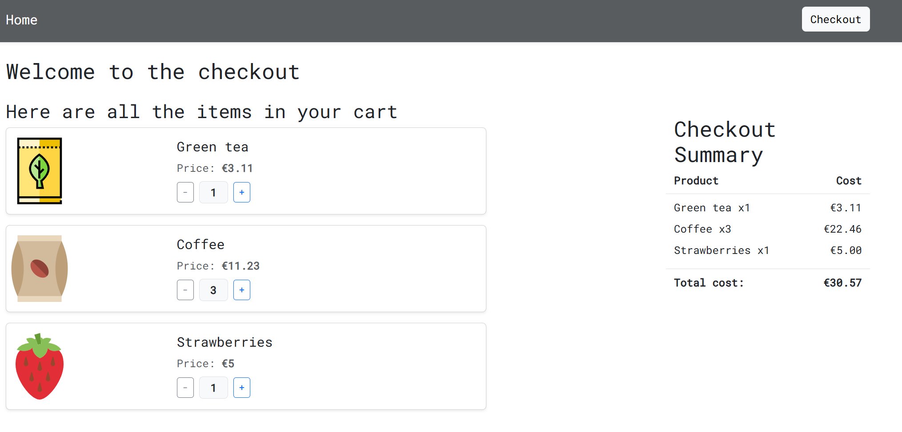

# Amenitiz Technical Assignment

The purpose of this application is to provide a check out service for calculating the cost of products which a customer wishes to buy.

The customer can calculate the cost of the checkout in any order.
This application is made up of a products API written using Ruby on Rails.
The frontend is a React application which is mounted in the Rails views.
API calls are made for Product and Promotion details which are persisted in Postgres.
Cart items are stored in localStorage and passed to the backed to calculate costs when checkout is requested.

## System dependencies
- Docker (for local instance of Postgres)
- Ruby (version specified in .ruby-verion file)
- Rails
- Node (version specified in .nvmrc file)
- Yarn

## Database creation
- Run `docker compose up` to initialise a Postgres DB locally
Once this is up and running you can run:
- `bundle exec rails db:create` (To connect rails to the database)
- `bundle exec rails db:migrate` (To run migrations to establish the DB Schema)
- `bundle exec rails db:seed` (To populate the appropriate sample data)

## Running the application locally.
Assuming PostgresDB has been initialised successfully

1. Run `bundle install` to install all Ruby gems.
2. Run `yarn install` to install JavaScript packages.
3. Run `bin/vite dev` To start the vite server for frontend assets
4. Run `bundle exec rails s` To start the rails server locally.

## How to run the test suite
- `bundle exec rspec spec` - To run ruby based tests
- `yarn test` - To run JavaScript test suite using Vitest

Note:
A local instance of a chromium based browser is required for capybara feature tests to be run locally through Selenium.

To skip Capybara tests locally you can use the following:
- `bundle exec rspec --format documentation --exclude-pattern "spec/features/*_spec.rb"`

## Description of CI tooling
### Linting
- [StandardJS](https://standardjs.com/) for JavaScript
(If you have any issues setting up linters you can also run `npx standard --fix` to resolve linting issues)
- [StandardRB](https://github.com/standardrb/standard) for Ruby.
(If you have any issues setting up linters you can also run `bundle exec rake standard:fix` to resolve linting issues)
- `yarn audit` is run to look for vulnerabilities in JS packages.
- [Brakeman](https://brakemanscanner.org/) gem is running for security analysis of Ruby Packages.

### Testing
Ruby:
Automated execution of RSpec testing takes place on push to branch.
Additionally Capybara is in place for end to end testing using Selenium WebDriver.

JavaScript:
Vitest is running in the Test CI pipeline to ensure passing tests in the CI.

